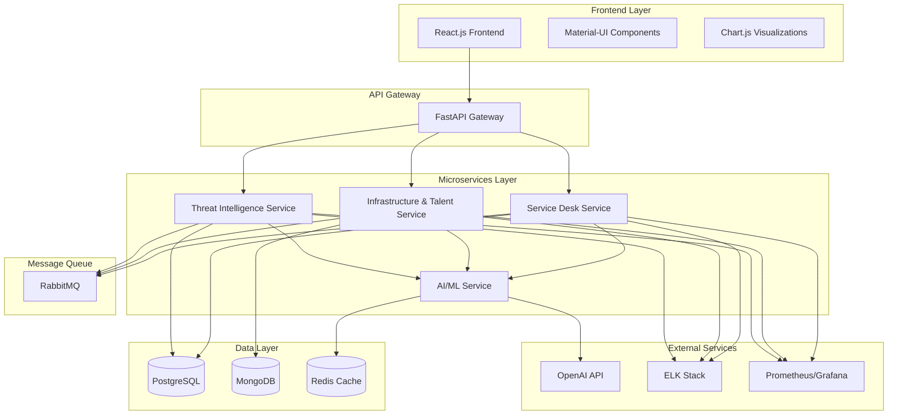
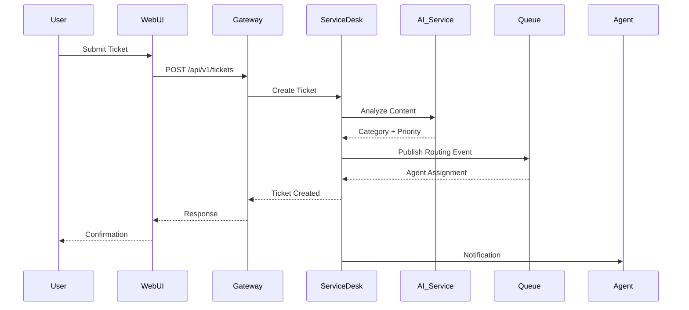

# Functional Requirements Document (FRD)
## Aura – AI-Powered IT Management Suite

---

**Project Name**: Aura – The AI-Powered IT Management Suite  
**Team Name**: Aura  
**Lead Architect**: Raghavendra Reddy Bijjula  
**Hackathon**: Superhack 2025  
**Document Version**: 1.0  
**Last Updated**: January 15, 2025  

---

## 1. System Overview & Architecture

### 1.1 Vision Statement
Aura is an AI-powered IT management suite designed to revolutionize IT operations through intelligent automation, predictive analytics, and seamless user experience. The system leverages advanced machine learning and natural language processing to streamline service desk operations, optimize resource management, and enhance security intelligence.

### 1.2 System Architecture



### 1.3 Core Principles
- **Event-Driven Architecture**: Asynchronous processing using RabbitMQ
- **Microservices Design**: Loosely coupled, independently deployable services
- **AI-First Approach**: ML/AI integrated at every layer
- **Real-time Processing**: WebSocket connections for live updates
- **Scalable Infrastructure**: Horizontal scaling capabilities

---

## 2. Functional Modules

### 2.1 Service Desk Automation Module

#### 2.1.1 Ticket Categorization & Routing
**Purpose**: Automatically classify and route incoming support tickets using NLP.

**Core Functions**:
- **Ticket Ingestion**: Accept tickets from multiple channels (email, web form, API)
- **NLP Classification**: Analyze ticket content using spaCy and HuggingFace models
- **Priority Assignment**: Determine urgency based on content analysis and business rules
- **Auto-Routing**: Assign tickets to appropriate IT agents based on:
  - Skill matching
  - Current workload
  - Availability status
  - Historical performance

**Technical Specifications**:
- **Input**: Ticket data (title, description, attachments, user info)
- **Processing**: Real-time NLP analysis with 95% accuracy target
- **Output**: Categorized ticket with assigned agent and priority
- **Performance**: Process tickets within 30 seconds

#### 2.1.2 Knowledge Base Integration
**Purpose**: Provide intelligent knowledge base search and article recommendations.

**Core Functions**:
- **Semantic Search**: Vector-based search using embeddings
- **Gap Analysis**: Identify missing KB articles using ML
- **Auto-Suggestions**: Generate article recommendations for agents
- **Content Generation**: AI-assisted KB article creation

#### 2.1.3 Chatbot Self-Service
**Purpose**: Enable users to resolve common issues through conversational AI.

**Core Functions**:
- **Intent Recognition**: Understand user queries using NLU
- **Solution Matching**: Find relevant solutions from KB
- **Escalation Logic**: Seamlessly transfer to human agents when needed
- **Learning Loop**: Improve responses based on user feedback

### 2.2 Infrastructure & Talent Management Module

#### 2.2.1 Resource Optimization
**Purpose**: Optimize IT infrastructure usage and performance.

**Core Functions**:
- **Resource Monitoring**: Track server, network, and application performance
- **Predictive Analytics**: Forecast resource needs using historical data
- **Auto-Scaling**: Recommend scaling actions based on usage patterns
- **Cost Optimization**: Identify underutilized resources

#### 2.2.2 Skill Mapping & Workload Distribution
**Purpose**: Match the right talent to the right tasks for optimal efficiency.

**Core Functions**:
- **Skill Assessment**: Analyze agent capabilities and expertise areas
- **Workload Balancing**: Distribute tasks based on capacity and skills
- **Performance Analytics**: Track agent productivity and satisfaction
- **Training Recommendations**: Suggest skill development opportunities

### 2.3 Threat Intelligence Module

#### 2.3.1 Security Analysis
**Purpose**: Proactive threat detection and security monitoring.

**Core Functions**:
- **Anomaly Detection**: Identify unusual patterns in system behavior
- **Threat Classification**: Categorize security incidents by severity
- **Risk Assessment**: Calculate potential impact of identified threats
- **Compliance Monitoring**: Ensure adherence to security policies

#### 2.3.2 Automated Response
**Purpose**: Rapid response to security incidents.

**Core Functions**:
- **Incident Triage**: Prioritize security incidents automatically
- **Response Orchestration**: Execute predefined response playbooks
- **Alert Management**: Send notifications to appropriate stakeholders
- **Recovery Planning**: Suggest remediation steps

---

## 3. API Specifications

### 3.1 Service Desk APIs

#### 3.1.1 Ticket Management
```python
# Create Ticket
POST /api/v1/tickets
{
    "title": "string",
    "description": "string",
    "category": "string",
    "priority": "low|medium|high|critical",
    "user_id": "string",
    "attachments": ["file_urls"]
}

# Get Tickets
GET /api/v1/tickets?status=open&assigned_to=agent_id&limit=50

# Update Ticket
PUT /api/v1/tickets/{ticket_id}
{
    "status": "open|in_progress|resolved|closed",
    "assigned_to": "agent_id",
    "resolution": "string"
}

# Auto-Categorize Ticket
POST /api/v1/tickets/{ticket_id}/categorize
Response: {
    "category": "string",
    "confidence": "float",
    "suggested_agent": "string"
}
```

#### 3.1.2 Knowledge Base APIs
```python
# Search Knowledge Base
POST /api/v1/kb/search
{
    "query": "string",
    "limit": 10
}

# Create KB Article
POST /api/v1/kb/articles
{
    "title": "string",
    "content": "string",
    "category": "string",
    "tags": ["string"]
}

# Get Article Recommendations
GET /api/v1/kb/recommendations?ticket_id={ticket_id}
```

### 3.2 Infrastructure & Talent APIs

#### 3.2.1 Resource Management
```python
# Get Resource Metrics
GET /api/v1/infrastructure/metrics?timeframe=24h

# Get Scaling Recommendations
GET /api/v1/infrastructure/recommendations

# Agent Workload
GET /api/v1/agents/{agent_id}/workload
POST /api/v1/agents/{agent_id}/assign
{
    "ticket_id": "string",
    "estimated_effort": "integer"
}
```

### 3.3 Threat Intelligence APIs

#### 3.3.1 Security Monitoring
```python
# Get Security Alerts
GET /api/v1/security/alerts?severity=high&status=active

# Create Security Incident
POST /api/v1/security/incidents
{
    "title": "string",
    "description": "string",
    "severity": "low|medium|high|critical",
    "affected_systems": ["string"]
}

# Execute Response Action
POST /api/v1/security/incidents/{incident_id}/respond
{
    "action": "isolate|block|notify|investigate",
    "parameters": {}
}
```

---

## 4. Data Flow & Interactions

### 4.1 Ticket Processing Flow


### 4.2 Real-time Updates
- **WebSocket Connections**: Live ticket status updates
- **Event Broadcasting**: System-wide notifications
- **Dashboard Refresh**: Real-time metrics and KPIs

---

## 5. User Roles & Access Control

### 5.1 Role Definitions

#### 5.1.1 End User
- **Permissions**: Submit tickets, view own tickets, access self-service chatbot
- **Restrictions**: Cannot view other users' tickets or system metrics

#### 5.1.2 IT Agent
- **Permissions**: View assigned tickets, update ticket status, access knowledge base, use AI recommendations
- **Restrictions**: Cannot access admin functions or system configuration

#### 5.1.3 IT Manager
- **Permissions**: View team performance, assign tickets, access analytics dashboards, manage knowledge base
- **Restrictions**: Cannot modify system configuration

#### 5.1.4 System Administrator
- **Permissions**: Full system access, user management, system configuration, view all metrics
- **Restrictions**: None

### 5.2 Authentication & Authorization
- **Authentication**: JWT-based with FastAPI Users
- **Authorization**: Role-based access control (RBAC)
- **Session Management**: Redis-based session storage
- **API Security**: Rate limiting and API key validation

---

## 6. Error Handling & Logging

### 6.1 Error Categories
- **Validation Errors**: Input validation failures (HTTP 400)
- **Authentication Errors**: Invalid credentials (HTTP 401)
- **Authorization Errors**: Insufficient permissions (HTTP 403)
- **Not Found Errors**: Resource not found (HTTP 404)
- **Server Errors**: Internal processing errors (HTTP 500)
- **Service Unavailable**: External service failures (HTTP 503)

### 6.2 Error Response Format
```json
{
    "error": {
        "code": "VALIDATION_ERROR",
        "message": "Invalid input data",
        "details": {
            "field": "email",
            "issue": "Invalid email format"
        },
        "timestamp": "2025-01-15T18:30:00Z",
        "request_id": "req_123456"
    }
}
```

### 6.3 Logging Strategy
- **Structured Logging**: JSON format with consistent fields
- **Log Levels**: DEBUG, INFO, WARN, ERROR, CRITICAL
- **Centralized Logging**: ELK Stack integration
- **Correlation IDs**: Request tracking across services
- **Performance Metrics**: Response times and resource usage

### 6.4 Monitoring & Alerting
- **Health Checks**: Service availability monitoring
- **Performance Metrics**: Prometheus metrics collection
- **Custom Dashboards**: Grafana visualization
- **Alert Rules**: Automated notifications for critical issues

---

## 7. Performance Requirements

### 7.1 Response Times
- **API Endpoints**: < 200ms for simple operations
- **Ticket Classification**: < 30 seconds
- **Search Operations**: < 500ms
- **Dashboard Loading**: < 2 seconds

### 7.2 Throughput
- **Concurrent Users**: Support 1000+ simultaneous users
- **Ticket Processing**: 100+ tickets per minute
- **API Requests**: 10,000+ requests per minute

### 7.3 Availability
- **System Uptime**: 99.9% availability
- **Database**: High availability with replication
- **Load Balancing**: Automatic failover capabilities

---

## 8. Security Requirements

### 8.1 Data Protection
- **Encryption**: TLS 1.3 for data in transit
- **Database**: Encryption at rest for sensitive data
- **API Security**: OAuth 2.0 / JWT authentication
- **Input Validation**: Comprehensive sanitization

### 8.2 Privacy Compliance
- **GDPR Compliance**: User data protection and right to deletion
- **Audit Logging**: Comprehensive activity tracking
- **Data Retention**: Configurable retention policies

---

## 9. Integration Requirements

### 9.1 External Systems
- **Email Integration**: SMTP/IMAP for ticket creation
- **Active Directory**: User authentication and authorization
- **Monitoring Tools**: Integration with existing monitoring solutions
- **Ticketing Systems**: Migration from legacy systems

### 9.2 API Integration
- **REST APIs**: Standard HTTP/JSON interfaces
- **Webhooks**: Event-driven notifications
- **GraphQL**: Flexible query interface for complex operations
- **SDK Support**: Python and JavaScript client libraries

---

## 10. Deployment & DevOps

### 10.1 Containerization
- **Docker**: Microservices containerization
- **Kubernetes**: Container orchestration
- **Helm Charts**: Deployment configuration management

### 10.2 CI/CD Pipeline
- **GitHub Actions**: Automated testing and deployment
- **Testing**: Unit, integration, and end-to-end tests
- **Code Quality**: Automated code review and security scanning
- **Deployment**: Blue-green deployment strategy

---

## 11. Open Questions

*Note: This section will be updated as clarifications are needed during implementation.*

1. **Single Sign-On**: Which SSO provider should be prioritized for integration?
2. **Legacy System Migration**: What is the timeline for migrating from existing ticketing systems?
3. **Compliance Requirements**: Are there specific industry compliance requirements (SOC 2, ISO 27001)?
4. **Localization**: Should the system support multiple languages in the initial release?

---

*This document serves as the technical foundation for the Aura project and will be updated as the system evolves and requirements are refined.*
