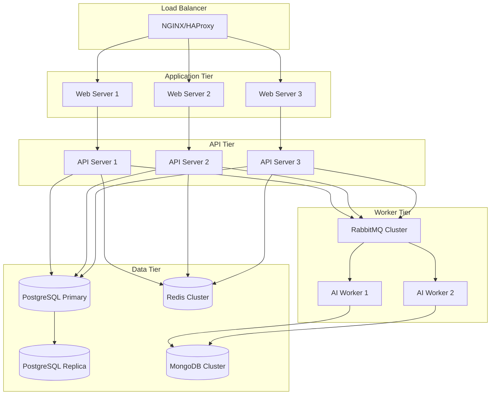

# Product Requirements Document (PRD)
## Aura – AI-Powered IT Management Suite

---

**Project Name**: Aura – The AI-Powered IT Management Suite  
**Team Name**: Aura  
**Lead Architect**: Raghavendra Reddy Bijjula  
**Hackathon**: Superhack 2025  
**Document Version**: 1.0  
**Last Updated**: January 15, 2025  

---

## 1. Product Vision & Strategic Goals

### 1.1 Product Vision
"Empower IT organizations with intelligent automation to deliver exceptional service experiences while optimizing operational efficiency through AI-driven insights and proactive management."

### 1.2 Mission Statement
Aura transforms traditional IT operations by leveraging artificial intelligence to automate routine tasks, enhance decision-making, and create seamless experiences for both IT teams and end users. Our platform reduces resolution times, improves first-call resolution rates, and enables IT professionals to focus on strategic initiatives rather than operational overhead.

### 1.3 Strategic Objectives
- **Operational Excellence**: Reduce average ticket resolution time by 60%
- **User Satisfaction**: Achieve 90%+ customer satisfaction scores
- **Cost Optimization**: Decrease IT operational costs by 40%
- **Scalability**: Support enterprise-level operations with 10,000+ users
- **Innovation**: Establish AI-first approach as industry standard

### 1.4 Success Metrics
- **First Call Resolution**: Target 75% (baseline: 45%)
- **Average Resolution Time**: Target 4 hours (baseline: 2 days)
- **Agent Productivity**: 150% increase in tickets handled per agent
- **User Self-Service**: 60% of issues resolved without human intervention
- **System Uptime**: 99.9% availability

---

## 2. Target Users & Personas

### 2.1 Primary Personas

#### 2.1.1 Sarah - IT Support Agent
**Demographics**: 25-35 years old, 3-7 years IT experience  
**Goals**: 
- Resolve tickets quickly and accurately
- Access relevant information efficiently
- Improve customer satisfaction scores
- Learn and grow technical skills

**Pain Points**:
- Manual ticket categorization takes too long
- Difficulty finding relevant knowledge base articles
- Repetitive tasks consume most of the day
- Lack of context about user's previous issues

**How Aura Helps**:
- AI automatically categorizes and prioritizes tickets
- Intelligent KB search with contextual recommendations
- Chatbot handles routine inquiries
- Comprehensive user history and insights

#### 2.1.2 Mike - IT Manager
**Demographics**: 35-45 years old, 10+ years IT leadership experience  
**Goals**:
- Optimize team performance and resource allocation
- Meet SLA commitments consistently
- Reduce operational costs
- Provide data-driven insights to leadership

**Pain Points**:
- Lack of visibility into team workload distribution
- Difficulty predicting resource needs
- Manual reporting is time-consuming
- Inconsistent service quality across agents

**How Aura Helps**:
- Real-time dashboard with team performance metrics
- Predictive analytics for resource planning
- Automated reporting and insights
- AI-driven workload balancing

#### 2.1.3 Lisa - End User (Employee)
**Demographics**: 25-55 years old, various technical skill levels  
**Goals**:
- Get quick resolution to IT issues
- Minimal disruption to work productivity
- Easy-to-use self-service options
- Clear communication about issue status

**Pain Points**:
- Long wait times for ticket resolution
- Having to repeat information multiple times
- Unclear status updates
- Complex processes for simple requests

**How Aura Helps**:
- Intelligent chatbot for instant self-service
- Automated status updates and notifications
- Streamlined ticket submission process
- Proactive issue prevention

### 2.2 Secondary Personas

#### 2.2.1 David - System Administrator
**Demographics**: 30-45 years old, 8+ years systems experience  
**Focus**: Infrastructure monitoring, security, system optimization
**Needs**: Advanced analytics, security insights, integration capabilities

#### 2.2.2 Jennifer - C-Level Executive
**Demographics**: 40-60 years old, business leadership  
**Focus**: ROI, strategic alignment, competitive advantage
**Needs**: Executive dashboards, cost analysis, business impact metrics

---

## 3. Use Cases & User Stories

### 3.1 Service Desk Automation

#### 3.1.1 Epic: Intelligent Ticket Management
**As an** IT support agent  
**I want** tickets to be automatically categorized and prioritized  
**So that** I can focus on resolution rather than administrative tasks  

**User Stories**:
- As an agent, I want new tickets to appear with suggested categories so I can quickly validate and proceed
- As an agent, I want to see AI-recommended solutions when I open a ticket so I can resolve issues faster
- As a manager, I want tickets automatically routed to available agents with relevant skills so workload is balanced
- As an end user, I want my urgent issues to be automatically prioritized so I get faster resolution

#### 3.1.2 Epic: Self-Service Capabilities
**As an** end user  
**I want** to resolve common issues without creating tickets  
**So that** I can get immediate help and IT can focus on complex problems  

**User Stories**:
- As an end user, I want to chat with an AI assistant that understands my IT problems
- As an end user, I want the chatbot to guide me through troubleshooting steps with screenshots
- As an end user, I want to escalate to a human agent seamlessly when the chatbot can't help
- As an IT manager, I want to see which issues are commonly resolved through self-service

### 3.2 Infrastructure & Talent Management

#### 3.2.1 Epic: Resource Optimization
**As an** IT manager  
**I want** predictive insights about infrastructure needs  
**So that** I can proactively manage resources and prevent outages  

**User Stories**:
- As a manager, I want to see predicted resource usage for the next 30 days
- As a manager, I want alerts when systems are approaching capacity limits
- As an administrator, I want recommendations for cost optimization opportunities
- As an executive, I want to understand the ROI of infrastructure investments

#### 3.2.2 Epic: Workload Distribution
**As an** IT manager  
**I want** AI-driven workload balancing across my team  
**So that** no agent is overwhelmed while others are underutilized  

**User Stories**:
- As a manager, I want to see real-time workload distribution across agents
- As a manager, I want tickets automatically assigned based on agent skills and availability
- As an agent, I want to receive tickets that match my expertise level
- As a manager, I want recommendations for training based on skill gaps

### 3.3 Threat Intelligence

#### 3.3.1 Epic: Proactive Security Monitoring
**As a** system administrator  
**I want** AI-powered threat detection and response  
**So that** security incidents are identified and mitigated quickly  

**User Stories**:
- As an admin, I want to receive alerts for unusual system behavior patterns
- As an admin, I want automated response actions for common security threats
- As a manager, I want to see security posture dashboards and trends
- As an executive, I want compliance reporting and risk assessments

---

## 4. Feature List & Roadmap

### 4.1 MVP Features (Phase 1 - Hackathon)

#### 4.1.1 Core Service Desk
- **Ticket Creation & Management**: Web form, email integration, basic CRUD operations
- **AI Categorization**: NLP-based ticket classification with 80%+ accuracy
- **Agent Dashboard**: Queue management, ticket assignment, status updates
- **Basic Knowledge Base**: Article search, viewing, basic creation
- **Simple Chatbot**: Rule-based responses for common queries

#### 4.1.2 Essential Analytics
- **Basic Metrics Dashboard**: Ticket volume, resolution times, agent performance
- **Simple Reporting**: Daily/weekly summaries, basic charts
- **User Management**: Role-based access, basic authentication

#### 4.1.3 Mobile-Responsive UI
- **Responsive Design**: Works on desktop, tablet, and mobile devices
- **Material-UI Components**: Consistent, modern interface
- **Real-time Updates**: Live status changes, basic notifications

### 4.2 Phase 2 Features (Post-Hackathon - Month 1-3)

#### 4.2.1 Advanced AI Capabilities
- **Intelligent Routing**: ML-based agent assignment with skill matching
- **Advanced Chatbot**: NLU-powered conversational AI with context awareness
- **Predictive Analytics**: Ticket volume forecasting, resource planning
- **Sentiment Analysis**: Customer satisfaction prediction

#### 4.2.2 Enhanced Integrations
- **Email System Integration**: Full SMTP/IMAP support with threading
- **Active Directory**: SSO and user synchronization
- **Monitoring Tools**: Integration with popular monitoring solutions
- **API Ecosystem**: Comprehensive REST and GraphQL APIs

#### 4.2.3 Advanced Analytics
- **Custom Dashboards**: Configurable widgets and metrics
- **Advanced Reporting**: Custom reports, scheduled delivery
- **Performance Analytics**: SLA tracking, trend analysis
- **Cost Analytics**: Resource utilization and cost optimization

### 4.3 Phase 3 Features (Month 4-6)

#### 4.3.1 Infrastructure Management
- **Resource Monitoring**: Real-time infrastructure metrics
- **Capacity Planning**: AI-driven resource forecasting
- **Auto-scaling Recommendations**: Intelligent scaling suggestions
- **Performance Optimization**: Automated performance tuning

#### 4.3.2 Advanced Security
- **Threat Detection**: ML-based anomaly detection
- **Automated Response**: Security incident orchestration
- **Compliance Monitoring**: Automated compliance checking
- **Risk Assessment**: AI-powered risk scoring

#### 4.3.3 Enterprise Features
- **Multi-tenant Architecture**: Support for multiple organizations
- **Advanced Workflows**: Custom automation and approval processes
- **Enterprise Integrations**: ITSM, CMDB, and other enterprise tools
- **Advanced Analytics**: AI-driven insights and recommendations

### 4.4 Future Roadmap (Month 6+)

#### 4.4.1 AI Innovation
- **Conversational AI**: Advanced natural language interactions
- **Predictive Issue Prevention**: Proactive problem identification
- **Automated Resolution**: AI-driven problem solving
- **Continuous Learning**: Self-improving AI models

#### 4.4.2 Platform Extensions
- **Mobile Applications**: Native iOS and Android apps
- **Voice Integration**: Voice-activated ticket creation and updates
- **IoT Integration**: Device monitoring and management
- **Blockchain Security**: Immutable audit trails and security

---

## 5. UI/UX Expectations

### 5.1 Design Principles

#### 5.1.1 User-Centric Design
- **Intuitive Navigation**: Clear information hierarchy and logical flow
- **Contextual Information**: Right information at the right time
- **Minimal Cognitive Load**: Simple, focused interfaces
- **Progressive Disclosure**: Advanced features available but not overwhelming

#### 5.1.2 Visual Design Standards
- **Material-UI Foundation**: Consistent component library
- **Modern Aesthetics**: Clean, professional appearance
- **Brand Consistency**: Cohesive visual identity
- **Accessibility**: WCAG 2.1 AA compliance

### 5.2 Key User Interfaces

#### 5.2.1 Agent Dashboard
```
┌─────────────────────────────────────────────────────────────┐
│ Aura IT Management Suite                     🔔 📊 👤 ⚙️    │
├─────────────────────────────────────────────────────────────┤
│ My Queue (12) │ All Tickets │ Knowledge Base │ Analytics    │
├─────────────────────────────────────────────────────────────┤
│ 🔥 High Priority (3)  📊 Today's Stats  🎯 AI Suggestions   │
│ ┌─────────────────┐  ┌─────────────────┐  ┌─────────────────┐ │
│ │ #12345          │  │ Resolved: 8     │  │ Password Reset  │ │
│ │ Password Reset  │  │ Pending: 4      │  │ → KB Article    │ │
│ │ 👤 John Doe     │  │ Avg Time: 2.3h  │  │ #KB001         │ │
│ │ ⏰ 15 min ago   │  └─────────────────┘  └─────────────────┘ │
│ └─────────────────┘                                         │
└─────────────────────────────────────────────────────────────┘
```

#### 5.2.2 Ticket Detail View
```
┌─────────────────────────────────────────────────────────────┐
│ ← Back to Queue    Ticket #12345                    [Assign]│
├─────────────────────────────────────────────────────────────┤
│ 🔥 HIGH | 💻 Hardware | 📍 Open | ⏰ 15 min ago              │
├─────────────────────────────────────────────────────────────┤
│ Password Reset Request                                      │
│ 👤 John Doe (john.doe@company.com) | 🏢 Marketing Dept     │
│                                                             │
│ "I can't log into my computer this morning. I think I      │
│ forgot my password after the weekend..."                   │
│                                                             │
│ 🤖 AI Suggestions:                                          │
│ • Password reset procedure (KB #001) - 95% match          │
│ • Check account lockout status                             │
│ • Verify user identity before reset                        │
│                                                             │
│ ┌─────────────────────────────────────────────────────────┐ │
│ │ Add Comment or Resolution...                            │ │
│ │                                                         │ │
│ │ [📎 Attach] [🤖 AI Help] [✅ Resolve] [➡️ Escalate]    │ │
│ └─────────────────────────────────────────────────────────┘ │
└─────────────────────────────────────────────────────────────┘
```

#### 5.2.3 Chatbot Interface (End User)
```
┌─────────────────────────────────────────────────────────────┐
│ Aura IT Assistant 🤖                              [Minimize]│
├─────────────────────────────────────────────────────────────┤
│                                                             │
│ 🤖 Hi! I'm Aura, your IT assistant. How can I help you    │
│     today?                                                 │
│                                                             │
│ 👤 I can't access my email                                 │
│                                                             │
│ 🤖 I can help with email issues! Let me ask a few         │
│     questions:                                             │
│     • Are you getting any error messages?                 │
│     • When did this issue start?                          │
│     • Are you using Outlook or webmail?                   │
│                                                             │
│ 👤 Getting "connection failed" in Outlook                  │
│                                                             │
│ 🤖 I found a solution! Try these steps:                   │
│     1. Check your internet connection                     │
│     2. Restart Outlook                                     │
│     3. Clear your credentials and re-enter                │
│                                                             │
│     Need help with any of these steps? 🔧                 │
│                                                             │
│ ┌─────────────────────────────────────────────────────────┐ │
│ │ Type your message...                    [Send] [📞 Call]│ │
│ └─────────────────────────────────────────────────────────┘ │
└─────────────────────────────────────────────────────────────┘
```

### 5.3 Responsive Design Requirements

#### 5.3.1 Breakpoints
- **Mobile**: 320px - 767px (Portrait phones, small landscape phones)
- **Tablet**: 768px - 1023px (Tablets, large phones in landscape)  
- **Desktop**: 1024px - 1439px (Small desktops, laptops)
- **Large Desktop**: 1440px+ (Large desktops, external monitors)

#### 5.3.2 Mobile-First Approach
- **Progressive Enhancement**: Start with mobile design, enhance for larger screens
- **Touch-Friendly**: Minimum 44px touch targets, appropriate spacing
- **Performance**: Optimized loading for mobile networks
- **Offline Capability**: Basic functionality available without internet

#### 5.3.3 Cross-Platform Compatibility
- **Browsers**: Chrome 90+, Firefox 88+, Safari 14+, Edge 90+
- **Operating Systems**: Windows 10+, macOS 10.15+, iOS 14+, Android 10+
- **Screen Readers**: NVDA, JAWS, VoiceOver compatibility

---

## 6. Performance, Scalability & Security Requirements

### 6.1 Performance Requirements

#### 6.1.1 Response Time Targets
- **Page Load Time**: < 3 seconds on 3G connection
- **API Response Time**: < 200ms for 95% of requests
- **Search Results**: < 500ms for knowledge base queries
- **Real-time Updates**: < 100ms notification delivery
- **File Upload**: Support up to 25MB attachments with progress indicators

#### 6.1.2 Scalability Targets
- **Concurrent Users**: 1,000+ simultaneous active users
- **Ticket Volume**: 10,000+ tickets per day processing capability
- **Data Storage**: Support for 10+ million historical tickets
- **API Throughput**: 10,000+ requests per minute
- **Geographic Distribution**: Multi-region deployment capability

#### 6.1.3 Resource Optimization
- **Client-side Caching**: Intelligent caching of static resources
- **CDN Integration**: Global content delivery for static assets
- **Database Optimization**: Query optimization and indexing strategy
- **Memory Management**: Efficient memory usage patterns
- **Network Efficiency**: Minimal payload sizes, compression

### 6.2 Security Requirements

#### 6.2.1 Authentication & Authorization
- **Multi-Factor Authentication**: Support for TOTP, SMS, and hardware tokens
- **Single Sign-On**: SAML 2.0 and OAuth 2.0 integration
- **Session Management**: Secure session handling with automatic timeout
- **Password Policy**: Configurable complexity requirements
- **Account Lockout**: Brute force protection mechanisms

#### 6.2.2 Data Protection
- **Data Encryption**: AES-256 encryption for data at rest
- **Transport Security**: TLS 1.3 for all data in transit
- **API Security**: Rate limiting, request validation, API key management
- **Input Sanitization**: Comprehensive XSS and injection prevention
- **File Security**: Malware scanning for uploaded attachments

#### 6.2.3 Privacy & Compliance
- **GDPR Compliance**: Right to be forgotten, data portability, consent management
- **HIPAA Compatibility**: Healthcare data handling capabilities
- **SOC 2 Type II**: Security controls and compliance reporting
- **Audit Logging**: Comprehensive activity tracking and log retention
- **Data Residency**: Configurable data location controls

#### 6.2.4 Infrastructure Security
- **Network Security**: VPC isolation, security groups, WAF protection
- **Container Security**: Image scanning, runtime protection
- **Secrets Management**: Secure credential storage and rotation
- **Backup Security**: Encrypted backups with integrity verification
- **Disaster Recovery**: RTO < 4 hours, RPO < 1 hour

---

## 7. Integration & Deployment Strategy

### 7.1 Integration Architecture

#### 7.1.1 Internal Integrations
- **Microservices Communication**: REST APIs with circuit breaker patterns
- **Event-Driven Architecture**: RabbitMQ for asynchronous processing
- **Database Integration**: PostgreSQL for transactional data, MongoDB for documents
- **Caching Layer**: Redis for session management and performance optimization
- **Search Engine**: Elasticsearch for full-text search capabilities

#### 7.1.2 External System Integrations
- **Email Systems**: SMTP/IMAP integration for ticket creation and notifications
- **Active Directory/LDAP**: User authentication and group synchronization
- **Monitoring Tools**: Nagios, Zabbix, SolarWinds integration
- **ITSM Platforms**: ServiceNow, Remedy, Jira Service Management
- **Communication Platforms**: Slack, Microsoft Teams notifications

#### 7.1.3 Third-Party Services
- **AI/ML Services**: OpenAI API, Azure Cognitive Services, AWS Comprehend
- **File Storage**: AWS S3, Azure Blob Storage, Google Cloud Storage
- **Analytics**: Google Analytics, Mixpanel, custom analytics
- **Payment Processing**: Stripe, PayPal for billing (if applicable)
- **Notification Services**: Twilio, SendGrid, PushBullet

### 7.2 Deployment Strategy

#### 7.2.1 Infrastructure Architecture


#### 7.2.2 Deployment Environments
- **Development**: Individual developer environments with Docker Compose
- **Staging**: Production-like environment for testing and QA
- **Production**: High-availability, multi-region deployment
- **DR (Disaster Recovery)**: Backup region with automated failover

#### 7.2.3 CI/CD Pipeline

```mermaid
graph LR
    DEV[Developer] --> GIT[Git Repository]
    GIT --> CI[GitHub Actions]
    CI --> TEST[Automated Tests]
    TEST --> SCAN[Security Scan]
    SCAN --> BUILD[Build & Package]
    BUILD --> STAGE[Deploy Staging]
    STAGE --> APPROVE[Manual Approval]
    APPROVE --> PROD[Deploy Production]
    PROD --> MONITOR[Health Check]
```


**Pipeline Stages**:
1. **Code Quality**: ESLint, Prettier, SonarQube analysis
2. **Testing**: Unit tests, integration tests, API tests
3. **Security**: SAST, DAST, dependency vulnerability scanning
4. **Build**: Docker image creation, artifact generation
5. **Deployment**: Blue-green deployment with health checks
6. **Monitoring**: Post-deployment verification and alerting

### 7.3 Monitoring & Observability

#### 7.3.1 Application Monitoring
- **Performance Metrics**: Response times, throughput, error rates
- **Business Metrics**: Ticket resolution times, user satisfaction scores
- **AI/ML Metrics**: Model accuracy, prediction confidence, training metrics
- **User Experience**: Page load times, conversion rates, abandonment rates

#### 7.3.2 Infrastructure Monitoring
- **System Metrics**: CPU, memory, disk, network utilization
- **Container Metrics**: Pod health, resource consumption, scaling events
- **Database Metrics**: Query performance, connection pools, replication lag
- **External Dependencies**: Third-party service availability and performance

#### 7.3.3 Alerting Strategy
- **Severity Levels**: Critical, High, Medium, Low with appropriate escalation
- **Alert Channels**: Email, Slack, PagerDuty, SMS for critical issues
- **Alert Suppression**: Intelligent deduplication and noise reduction
- **Runbooks**: Automated response procedures for common issues

---

## 8. Success Criteria & KPIs

### 8.1 Business Success Metrics

#### 8.1.1 Operational Efficiency
- **Ticket Volume Handling**: 300% increase in tickets processed per agent
- **Resolution Time**: 60% reduction in average resolution time
- **First Call Resolution**: Increase from 45% to 75%
- **Agent Utilization**: 40% increase in productive work time
- **Cost per Ticket**: 50% reduction in operational cost per ticket

#### 8.1.2 User Satisfaction
- **Customer Satisfaction Score**: Target 4.5/5.0 (90%+ satisfaction)
- **Net Promoter Score**: Target NPS > 50
- **Self-Service Success Rate**: 60% of issues resolved without human intervention
- **User Adoption Rate**: 80% of end users actively using self-service features
- **Agent Satisfaction**: 85%+ agent satisfaction with the platform

#### 8.1.3 System Performance
- **System Availability**: 99.9% uptime (target 99.95%)
- **Performance**: 95% of requests processed under 200ms
- **Scalability**: Handle 10x current load without degradation
- **Security**: Zero critical security incidents
- **Data Quality**: 99.9% data integrity and accuracy

### 8.2 AI/ML Performance Metrics

#### 8.2.1 Classification Accuracy
- **Ticket Categorization**: 95% accuracy in automatic classification
- **Priority Assignment**: 90% accuracy in urgency determination
- **Agent Routing**: 85% accuracy in skill-based assignment
- **Solution Recommendation**: 80% acceptance rate of AI suggestions

#### 8.2.2 Prediction Quality
- **Resource Forecasting**: 85% accuracy in capacity planning
- **Issue Prevention**: 70% reduction in recurring issues
- **Sentiment Analysis**: 90% accuracy in customer satisfaction prediction
- **Anomaly Detection**: 95% true positive rate, <5% false positive rate

### 8.3 Technical Quality Metrics

#### 8.3.1 Code Quality
- **Test Coverage**: 90%+ code coverage across all services
- **Security Vulnerabilities**: Zero high/critical vulnerabilities in production
- **Code Complexity**: Maintain cyclomatic complexity < 10
- **Documentation**: 100% API documentation coverage

#### 8.3.2 Deployment Metrics
- **Deployment Frequency**: Daily deployments to production
- **Lead Time**: < 2 hours from commit to production
- **Change Failure Rate**: < 5% of deployments require rollback
- **Recovery Time**: < 1 hour mean time to recovery (MTTR)

---

## 9. Risk Assessment & Mitigation

### 9.1 Technical Risks

#### 9.1.1 AI/ML Model Performance
**Risk**: AI models may not achieve target accuracy in production
**Impact**: High - Core differentiator functionality compromised
**Probability**: Medium
**Mitigation**: 
- Extensive training data collection and validation
- A/B testing of model versions
- Fallback to rule-based systems
- Continuous model retraining and improvement

#### 9.1.2 Scalability Challenges
**Risk**: System may not handle expected load
**Impact**: High - Service degradation and customer dissatisfaction
**Probability**: Medium
**Mitigation**:
- Load testing throughout development
- Horizontal scaling architecture
- Performance monitoring and alerting
- Auto-scaling capabilities

#### 9.1.3 Integration Complexity
**Risk**: Third-party integrations may fail or be unreliable
**Impact**: Medium - Reduced functionality and user experience
**Probability**: High
**Mitigation**:
- Circuit breaker patterns for external services
- Graceful degradation when services unavailable
- Multiple provider options where possible
- Comprehensive monitoring and alerting

### 9.2 Business Risks

#### 9.2.1 User Adoption
**Risk**: Users may resist adopting AI-powered features
**Impact**: High - Reduced ROI and business value
**Probability**: Medium
**Mitigation**:
- Comprehensive change management program
- Training and support resources
- Gradual feature rollout with opt-in options
- Clear value demonstration and success stories

#### 9.2.2 Data Privacy Concerns
**Risk**: Privacy regulations may limit AI/ML capabilities
**Impact**: Medium - Reduced functionality in certain regions
**Probability**: Medium
**Mitigation**:
- Privacy-by-design architecture
- Configurable data handling policies
- Regular compliance audits
- Legal review of all data processing activities

### 9.3 Security Risks

#### 9.3.1 Data Breaches
**Risk**: Unauthorized access to sensitive IT data
**Impact**: Critical - Legal, financial, and reputational damage
**Probability**: Low
**Mitigation**:
- Multi-layered security controls
- Regular security audits and penetration testing
- Incident response plan and procedures
- Employee security training

#### 9.3.2 AI Model Attacks
**Risk**: Adversarial attacks on ML models
**Impact**: Medium - Reduced accuracy and potential security issues
**Probability**: Low
**Mitigation**:
- Model validation and testing against adversarial inputs
- Input sanitization and validation
- Model monitoring for unusual patterns
- Regular model updates and retraining

---

## 10. Go-to-Market Strategy

### 10.1 Launch Strategy

#### 10.1.1 Phased Rollout
**Phase 1**: Internal beta with select IT teams (2 weeks)
**Phase 2**: Limited customer beta (1 month)
**Phase 3**: Gradual market release (3 months)
**Phase 4**: Full market availability

#### 10.1.2 Target Market Segments
- **Primary**: Mid-market companies (500-5000 employees)
- **Secondary**: Enterprise organizations (5000+ employees)
- **Tertiary**: Small businesses with growing IT needs (100-500 employees)

#### 10.1.3 Pricing Strategy
- **Freemium**: Basic features for up to 5 agents
- **Professional**: $50/agent/month for full features
- **Enterprise**: Custom pricing with advanced integrations
- **AI Add-on**: $20/agent/month for advanced AI features

### 10.2 Marketing Positioning

#### 10.2.1 Value Propositions
- **For IT Managers**: "Reduce costs by 40% while improving service quality"
- **For IT Agents**: "Focus on solving problems, not managing tickets"
- **For End Users**: "Get instant help when you need it most"
- **For Executives**: "Transform IT from cost center to business enabler"

#### 10.2.2 Competitive Differentiation
- **AI-First Approach**: Unlike traditional ITSM tools, AI is core to every feature
- **Ease of Use**: Intuitive interface requires minimal training
- **Rapid Deployment**: Go live in days, not months
- **Predictive Capabilities**: Prevent issues before they impact users

### 10.3 Success Measurement

#### 10.3.1 Launch Metrics
- **User Acquisition**: 100 new customers in first 6 months
- **Revenue**: $500K ARR by end of year 1
- **Market Share**: 5% of target market segment
- **Customer Retention**: 90% customer retention rate
- **Feature Adoption**: 70% of customers using AI features

#### 10.3.2 Product-Market Fit Indicators
- **Customer Satisfaction**: NPS > 50 within 6 months
- **Organic Growth**: 30% of new customers from referrals
- **Usage Patterns**: Daily active users > 60% of licensed users
- **Support Metrics**: < 2% support ticket rate per active user
- **Competitive Win Rate**: 60% win rate against direct competitors

---

## 11. Open Questions

*This section will be updated as clarifications are needed during development and launch.*

### 11.1 Product Strategy Questions
1. **Market Entry Strategy**: Should we focus on SMB or enterprise market first?
2. **Pricing Model**: Is freemium the right approach, or should we start with paid tiers only?
3. **Geographic Expansion**: Which international markets should we prioritize?
4. **Partnership Strategy**: Should we pursue strategic partnerships with major ITSM vendors?

### 11.2 Technical Implementation Questions
1. **AI Model Deployment**: Should we use cloud-based AI services or deploy models on-premises?
2. **Data Localization**: How do we handle data residency requirements in different countries?
3. **Mobile Strategy**: Should we build native apps or focus on responsive web design first?
4. **Integration Priorities**: Which third-party integrations are most critical for MVP?

### 11.3 Go-to-Market Questions
1. **Sales Strategy**: Should we use direct sales, channel partners, or self-service model?
2. **Customer Success**: What level of onboarding and support is needed for successful adoption?
3. **Marketing Channels**: Which marketing channels will be most effective for our target audience?
4. **Competitive Response**: How should we respond to competitive feature announcements?

---

## 12. Appendix

### 12.1 Glossary

- **AI/ML**: Artificial Intelligence and Machine Learning technologies
- **API**: Application Programming Interface
- **CSAT**: Customer Satisfaction Score
- **FCR**: First Call Resolution
- **ITSM**: IT Service Management
- **KB**: Knowledge Base
- **KPI**: Key Performance Indicator
- **MVP**: Minimum Viable Product
- **NLP**: Natural Language Processing
- **NPS**: Net Promoter Score
- **RBAC**: Role-Based Access Control  
- **SLA**: Service Level Agreement
- **SSO**: Single Sign-On
- **UI/UX**: User Interface / User Experience

### 12.2 References

- **ITIL Framework**: Best practices for IT service management
- **VIBE Coding Principles**: Visual-first, Incremental, Behavior-driven, Event-driven
- **CLINE Rules**: Consistency, Logic separation, Integration readiness, Non-blocking APIs, Extensibility
- **Material Design**: Google's design system for consistent UI components
- **WCAG 2.1**: Web Content Accessibility Guidelines

### 12.3 Version History

| Version | Date | Changes | Author |
|---------|------|---------|--------|
| 1.0 | 2025-01-15 | Initial PRD creation | Raghavendra Reddy Bijjula |

---

*This Product Requirements Document serves as the strategic foundation for Aura and will be updated regularly as the product evolves and market requirements change. All stakeholders should refer to this document for product direction, priorities, and success criteria.*
### 10.3 Success Measurement

#### 10.3.1 Launch Metrics
- **User Acquisition**: 100 new customers in first 6 months
- **Revenue**: $500K ARR by end of year 1
- **Market Share**: 5% of target market segment
- **Customer Retention**: 90% customer retention rate
- **Feature Adoption**: 70% of customers using AI features

#### 10.3.2 Product-Market Fit Indicators
- **Customer Satisfaction**: NPS > 50 within 6 months
- **Organic Growth**: 30% of new customers from referrals
- **Usage Patterns**: Daily active users > 60% of licensed users
- **Support Metrics**: < 2% support ticket rate per active user
- **Competitive Win Rate**: 60% win rate against direct competitors

---

## 11. Open Questions

*This section will be updated as clarifications are needed during development and launch.*

### 11.1 Product Strategy Questions
1. **Market Entry Strategy**: Should we focus on SMB or enterprise market first?
2. **Pricing Model**: Is freemium the right approach, or should we start with paid tiers only?
3. **Geographic Expansion**: Which international markets should we prioritize?
4. **Partnership Strategy**: Should we pursue strategic partnerships with major ITSM vendors?

### 11.2 Technical Implementation Questions
1. **AI Model Deployment**: Should we use cloud-based AI services or deploy models on-premises?
2. **Data Localization**: How do we handle data residency requirements in different countries?
3. **Mobile Strategy**: Should we build native apps or focus on responsive web design first?
4. **Integration Priorities**: Which third-party integrations are most critical for MVP?

### 11.3 Go-to-Market Questions
1. **Sales Strategy**: Should we use direct sales, channel partners, or self-service model?
2. **Customer Success**: What level of onboarding and support is needed for successful adoption?
3. **Marketing Channels**: Which marketing channels will be most effective for our target audience?
4. **Competitive Response**: How should we respond to competitive feature announcements?

---

## 12. Appendix

### 12.1 Glossary

- **AI/ML**: Artificial Intelligence and Machine Learning technologies
- **API**: Application Programming Interface
- **CSAT**: Customer Satisfaction Score
- **FCR**: First Call Resolution
- **ITSM**: IT Service Management
- **KB**: Knowledge Base
- **KPI**: Key Performance Indicator
- **MVP**: Minimum Viable Product
- **NLP**: Natural Language Processing
- **NPS**: Net Promoter Score
- **RBAC**: Role-Based Access Control  
- **SLA**: Service Level Agreement
- **SSO**: Single Sign-On
- **UI/UX**: User Interface / User Experience

### 12.2 References

- **ITIL Framework**: Best practices for IT service management
- **VIBE Coding Principles**: Visual-first, Incremental, Behavior-driven, Event-driven
- **CLINE Rules**: Consistency, Logic separation, Integration readiness, Non-blocking APIs, Extensibility
- **Material Design**: Google's design system for consistent UI components
- **WCAG 2.1**: Web Content Accessibility Guidelines

### 12.3 Version History

| Version | Date | Changes | Author |
|---------|------|---------|--------|
| 1.0 | 2025-01-15 | Initial PRD creation | Raghavendra Reddy Bijjula |

---

*This Product Requirements Document serves as the strategic foundation for Aura and will be updated regularly as the product evolves and market requirements change. All stakeholders should refer to this document for product direction, priorities, and success criteria.*
